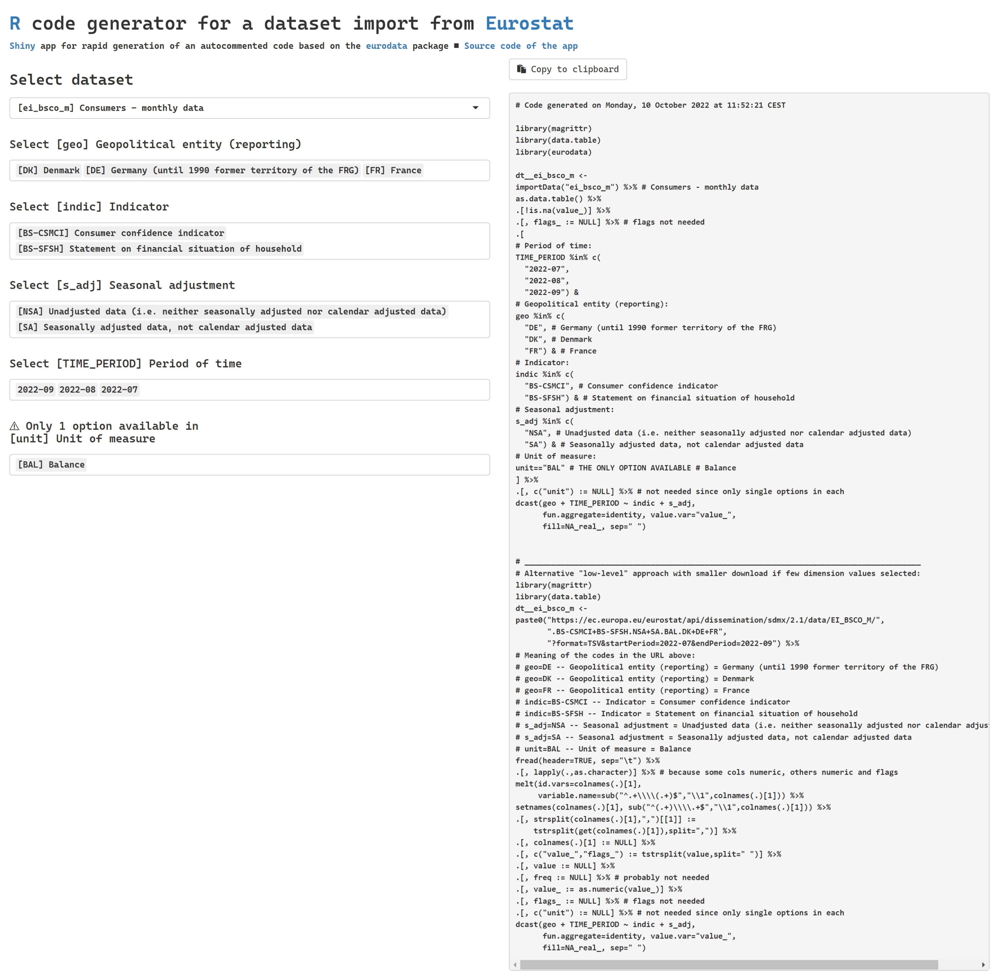

# eurodata_codegen
## [R](https://www.r-project.org) code generator for a dataset import from [Eurostat](https://ec.europa.eu/eurostat/databrowser/explore/all/all_themes)
### [Shiny](https://shiny.rstudio.com) app for rapid generation of an autocommented code based on the [eurodata](https://CRAN.R-project.org/package=eurodata) package

The app can be run in 3 ways:
- put the [app.R](https://raw.githubusercontent.com/alekrutkowski/eurodata_codegen/main/app.R) file in the appropriate sub-directory (sub-folder) of your [Shiny server](https://www.rstudio.com/products/shiny/shiny-server)'s root directory, e.g. in `/srv/shiny-server/eurodata_codegen`
- run locally in R with `source('https://raw.githubusercontent.com/alekrutkowski/eurodata_codegen/main/app.R')` (or with `source('app.R')` if the [app.R](https://raw.githubusercontent.com/alekrutkowski/eurodata_codegen/main/app.R) file is downloaded to your current working directory)
- in your web browser &ndash; just go to https://shiny-r.tk/eurodata_codegen

A screenshot:

