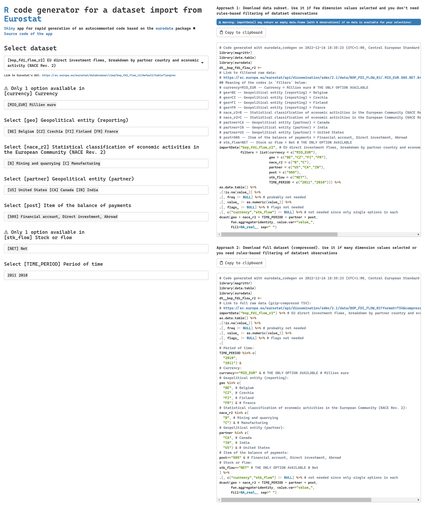

# eurodata_codegen
## R code generator for a dataset import from Eurostat
### Shiny app for rapid generation of an autocommented code based on the `eurodata` package

The `app.R` file can be put in the appropriate sub-directory (sub-folder) of the shiny-server root directory or it can be run locally in R with `source('https://raw.githubusercontent.com/alekrutkowski/eurodata_codegen/main/app.R')` (or with `source('app.R')` once the `app.R` file is downloaded to the current working directory).

The app can be also accessed at https://shiny-r.tk/eurodata_codegen.

A screenshot:

